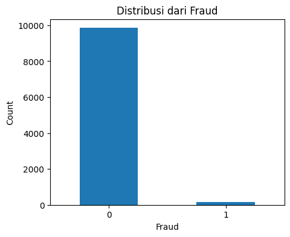

# 💳 Credit Card Fraud Detection - Exploratory Data Analysis (EDA)

## 📌 Project Overview

Proyek ini berfokus pada **Exploratory Data Analysis (EDA)** terhadap dataset transaksi kartu kredit untuk memahami karakteristik transaksi normal dan transaksi fraud. Analisis dilakukan untuk menemukan pola, hubungan antar fitur, serta memperoleh insight yang dapat digunakan sebagai dasar dalam membangun model Machine Learning untuk mendeteksi transaksi fraud.

---

## 🎯 Objectives

Tujuan dari proyek ini adalah:

- Memahami struktur dan karakteristik dataset.
- Mengidentifikasi distribusi transaksi fraud dan non-fraud.
- Menganalisis hubungan setiap fitur terhadap label fraud.
- Menemukan pola transaksi yang berpotensi mengindikasikan aktivitas fraud.
- Mengidentifikasi fitur-fitur yang memiliki potensi tinggi sebagai prediktor pada model Machine Learning.

---

## 📂 Dataset Features

Dataset terdiri dari beberapa fitur berikut.

| Feature | Description |
|----------|-------------|
| transaction_id | Unique transaction identifier |
| amount | Transaction amount |
| transaction_hour | Transaction hour (0–23) |
| merchant_category | Merchant category |
| foreign_transaction | Indicates whether the transaction is international |
| location_mismatch | Transaction location differs from cardholder location |
| device_trust_score | Device trust score |
| velocity_last_24h | Number of transactions within the last 24 hours |
| cardholder_age | Cardholder age |
| is_fraud | Target variable |

---

# 📊 Exploratory Data Analysis

## 1. Fraud Distribution

### Insight

- Total transaksi normal : **9849**
- Total transaksi fraud : **151**
- Fraud hanya sebesar **1.53%** dari keseluruhan transaksi.
- Dataset memiliki **class imbalance**, sehingga perlu dipertimbangkan teknik penanganan imbalance pada tahap Machine Learning.

---

## 2. Numerical Feature Distribution

### Insight

- Distribusi sebagian besar fitur numerik menunjukkan karakteristik **skewed distribution**.
- Beberapa fitur memiliki rentang nilai yang cukup lebar.
- Distribusi ini memberikan indikasi perlunya preprocessing sebelum modeling.

---

## 3. Outlier Distribution

### Insight

- Beberapa fitur memiliki outlier yang cukup banyak, terutama pada fitur **....**
- Outlier perlu dianalisis lebih lanjut untuk menentukan apakah merupakan nilai valid atau anomali.

---

# 📈 Feature Analysis

## Amount vs Fraud

### Insight

- Median transaksi fraud sebesar **....**
- Median transaksi normal sebesar **....**
- Transaksi fraud cenderung memiliki nilai transaksi yang **....**

---

## Cardholder Age vs Fraud

### Insight

- Rentang usia transaksi fraud berada pada **....**
- Perbedaan distribusi usia antara transaksi fraud dan normal menunjukkan bahwa **....**

---

## Device Trust Score vs Fraud

### Insight

- Device Trust Score pada transaksi fraud cenderung **....**
- Hal ini menunjukkan bahwa perangkat dengan tingkat kepercayaan rendah memiliki potensi risiko fraud yang lebih tinggi.

---

## Velocity Last 24 Hours vs Fraud

### Insight

- Fraud memiliki nilai transaction velocity sebesar **....**
- Semakin tinggi jumlah transaksi dalam 24 jam terakhir, semakin besar kemungkinan transaksi bersifat fraud.

---

# 🌍 Categorical Feature Analysis

## Foreign Transaction vs Fraud

### Insight

- Fraud lebih banyak ditemukan pada transaksi **....**
- Fraud Rate transaksi luar negeri sebesar **....%**
- Fraud Rate transaksi domestik sebesar **....%**

---

## Location Mismatch vs Fraud

### Insight

- Transaksi dengan Location Mismatch memiliki Fraud Rate sebesar **....%**
- Hal ini menunjukkan bahwa ketidaksesuaian lokasi merupakan salah satu indikator penting dalam deteksi fraud.

---

## Merchant Category vs Fraud

### Insight

- Merchant dengan jumlah fraud terbanyak adalah **....**
- Namun jumlah transaksi tidak selalu menunjukkan tingkat risiko fraud.

---

# 📊 Fraud Rate Analysis

## Fraud Rate by Merchant Category

### Insight

- Merchant dengan Fraud Rate tertinggi adalah **....**
- Merchant dengan Fraud Rate terendah adalah **....**

---

## Fraud Rate by Foreign Transaction

### Insight

- Fraud Rate transaksi luar negeri mencapai **....%**
- Fraud Rate transaksi domestik sebesar **....%**

---

## Fraud Rate by Location Mismatch

### Insight

- Fraud Rate meningkat ketika terjadi ketidaksesuaian lokasi transaksi.

---

## Fraud Rate by Transaction Hour

### Insight

- Aktivitas fraud paling tinggi terjadi pada pukul **....**
- Aktivitas fraud paling rendah terjadi pada pukul **....**

---

## Fraud vs Normal Transaction Hour

### Insight

- Pola transaksi fraud berbeda dibanding transaksi normal terutama pada jam **....**

---

## Fraud Rate by Foreign Transaction & Merchant Category

### Insight

- Kombinasi transaksi luar negeri dan merchant **....** memiliki Fraud Rate tertinggi.

---

## Fraud Rate by Transaction Hour & Foreign Transaction

### Insight

- Kombinasi transaksi luar negeri pada pukul **....** memiliki Fraud Rate sebesar **....%**
- Kombinasi fitur ini berpotensi menjadi feature engineering yang baik.

---

# 🔗 Correlation Analysis

## Correlation Matrix

### Insight

- Korelasi tertinggi terdapat antara fitur **....** dan **....**
- Tidak ditemukan multikolinearitas yang sangat tinggi antar fitur.

---

# 🤖 Feature Importance

## Top Feature Importance

### Insight

Fitur yang memiliki kontribusi terbesar terhadap prediksi fraud adalah:

1. **....**
2. **....**
3. **....**
4. **....**
5. **....**

Temuan ini menunjukkan bahwa fitur-fitur tersebut berpotensi menjadi prediktor utama dalam pembangunan model Machine Learning.

---

# 📌 EDA Summary

Berdasarkan hasil Exploratory Data Analysis diperoleh beberapa temuan penting:

- Dataset memiliki class imbalance dengan fraud sebesar **....%**.
- Transaksi fraud cenderung memiliki nilai transaksi **....**
- Device Trust Score pada transaksi fraud cenderung **....**
- Velocity transaksi fraud lebih **....**
- Fraud lebih sering terjadi pada transaksi **....**
- Location Mismatch meningkatkan peluang terjadinya fraud.
- Aktivitas fraud meningkat pada jam **....**
- Kombinasi **Foreign Transaction** dan **Transaction Hour** menunjukkan Fraud Rate tertinggi.
- Merchant Category memiliki tingkat risiko fraud yang berbeda-beda.
- Feature Importance menunjukkan bahwa fitur **....** merupakan fitur paling berpengaruh.

---

# 🚀 Next Step

Tahapan selanjutnya yang dapat dilakukan adalah:

- Data Preprocessing
- Feature Engineering
- Feature Selection
- Handling Class Imbalance (SMOTE / Class Weight)
- Model Building
    - Logistic Regression
    - Decision Tree
    - Random Forest
    - XGBoost
- Model Evaluation

---

## 🛠️ Libraries

- Python
- Pandas
- NumPy
- Matplotlib
- Seaborn
- Scikit-learn

---

## 👨‍💻 Author

**Muhammad Andi Ubaidillah**
